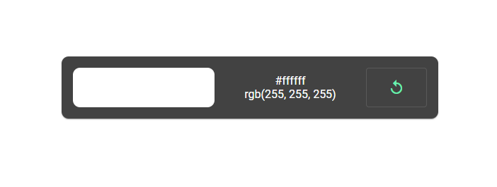

# Randomcolorpicker

##GitHub Pages

I hosted [Randomcolorpicker](https://aravindmarri.github.io/randomcolorpicker/) project using githubpages.

This project was generated with [Angular CLI](https://github.com/angular/angular-cli) version 11.2.12.

## Development server

Run `ng serve` for a dev server. Navigate to `http://localhost:4200/`. The app will automatically reload if you change any of the source files.

## Code scaffolding

Run `ng generate component component-name` to generate a new component. You can also use `ng generate directive|pipe|service|class|guard|interface|enum|module`.

## Build

Run `ng build` to build the project. The build artifacts will be stored in the `dist/` directory. Use the `--prod` flag for a production build.

## Running unit tests

Run `ng test` to execute the unit tests via [Karma](https://karma-runner.github.io).

## Running end-to-end tests

Run `ng e2e` to execute the end-to-end tests via [Protractor](http://www.protractortest.org/).

## Further help

To get more help on the Angular CLI use `ng help` or go check out the [Angular CLI Overview and Command Reference](https://angular.io/cli) page.

## Description

My project is about picking a random number and displaying its RGB code and Hex code of that randomly picked value and display that code color as well.
Below you can find some sample images of this project.
In my project, I follow the material design and material fundamentals.

Here I imported the npm package for the color pick manually in a popup. This code will help with the installation of the color picker package : npm install ngx-color-picker --save

##Sample Images of The project
Initial page of project:

Randomly Changed:

